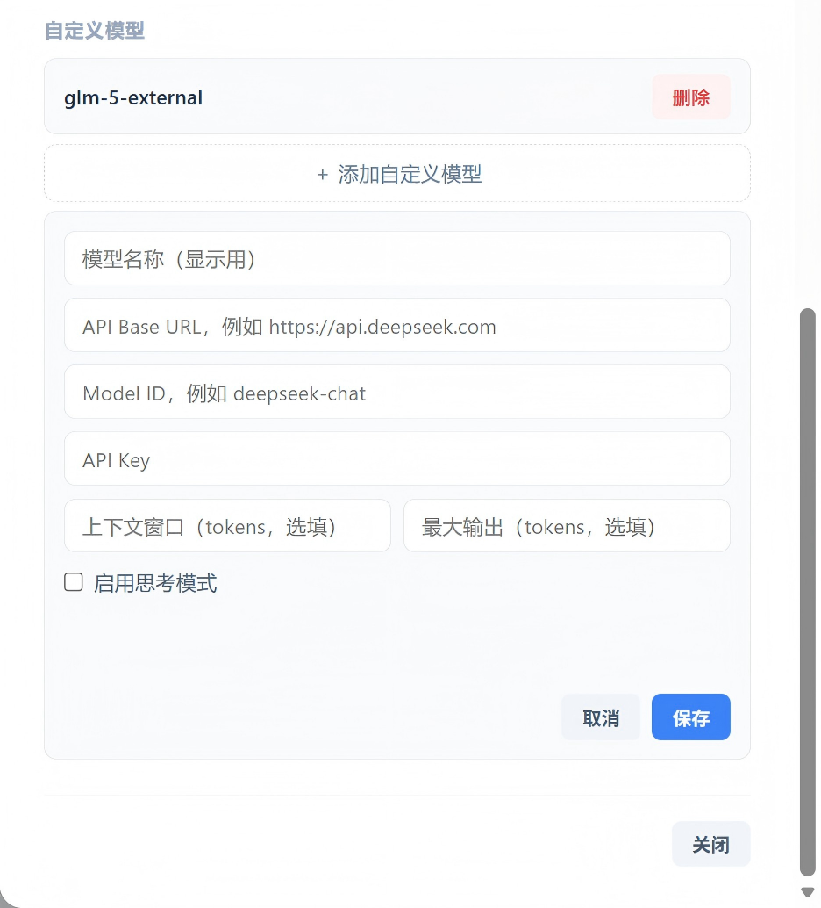

# Business Analyst Agent · 智能商业分析 Agent

<div align="right">

[English](./README_EN.md)

</div>

[](#)
[](#)
[](#)
[](#)
[](#)
[](LICENSE)

> 这是一个面向商业分析场景的 AI Agent：连接数据源后，用户用自然语言提问，系统自动完成 SQL 查询、图表生成与业务洞察输出。

---

## 项目介绍

**Business Analyst Agent** 是一个对话式商业数据分析系统。  
支持上传 Excel/CSV 或连接数据库（MySQL/PostgreSQL/SQLite/SQL Server），然后像聊天一样提问，系统会自动：

1. 识别数据结构（Schema）
2. 生成并执行 SQL
3. 自动选择并生成可视化图表（43 种）
4. 输出简洁业务洞察

通过 **SSE 流式输出**，你可以实时看到 Agent 的分析过程（读结构 → 查数据 → 出图表）。

---

## 核心特性

- **自然语言分析**：无需手写 SQL
- **多数据源接入**：Excel / CSV / MySQL / PostgreSQL / SQLite / SQL Server
- **智能图表推荐**：支持 43 种图表类型
- **SSE 实时反馈**：分析步骤透明可见
- **模型可配置**：DeepSeek / OpenAI / Claude / 任意 OpenAI 兼容接口
- **斜杠命令**：`/chart`（优先生成图表）、`/sql`（直接执行 SQL）and ongoing

---

## 界面预览

### Data Preview


### Data Query


### Custom Model


### Auto Generated Image


---

## 快速开始

### 环境要求
- Python 3.8+
- Windows（支持 `start.bat` 一键启动）

### 安装与启动

**方式 1：Windows 一键启动（推荐）**
```bash
start.bat